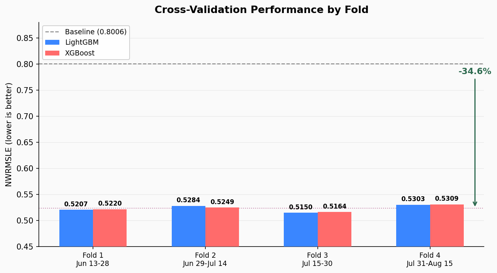
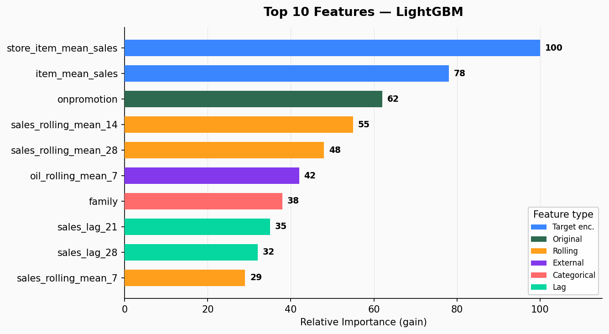

# Favorita Forecasting 2.0


Previsao de vendas diarias para a Corporacion Favorita, rede de supermercados do Equador com 54 lojas e ~4.100 produtos. Preve `unit_sales` num horizonte de 16 dias usando LightGBM e XGBoost com 90 features engenheiradas.

Baseado na competicao [Kaggle Corporacion Favorita Grocery Sales Forecasting](https://www.kaggle.com/c/favorita-grocery-sales-forecasting).

> Feature engineering levou o NWRMSLE de **0.8006** (baseline, 34 features) para **0.5236** (90 features), uma reducao de **34.6%**.
>
> | | Baseline | Modelo final | Variacao |
> |---|---|---|---|
> | Features | 34 (sem lags, sem rolling stats) | 90 (lags, rolling, target encoding, feriados, petroleo) | +56 features |
> | CV Media NWRMSLE | 0.8006 | 0.5236 | **-34.6%** |

## Resultados

### Validacao cruzada (4 folds, janela expansiva)

| Modelo | CV Media NWRMSLE | Val Final NWRMSLE | Tempo | Device |
|---|---|---|---|---|
| LightGBM | 0.5236 | 0.5304 | 2h 04min | CPU |
| XGBoost | 0.5235 | 0.5309 | 25.5 min | CUDA |

Os dois modelos chegaram em ~0.5236. XGBoost foi ~5x mais rapido na GPU.



<details>
<summary>Detalhes por fold</summary>

| Fold | Periodo de validacao | LGB NWRMSLE | LGB Iters | XGB NWRMSLE | XGB Iters |
|---|---|---|---|---|---|
| 1 | Jun 13 - Jun 28 | 0.5207 | 721 | 0.5220 | 1.069 |
| 2 | Jun 29 - Jul 14 | 0.5284 | 546 | 0.5249 | 1.418 |
| 3 | Jul 15 - Jul 30 | 0.5150 | 1.452 | 0.5164 | 1.817 |
| 4 | Jul 31 - Ago 15 | 0.5303 | 899 | 0.5309 | 1.513 |

</details>

### Top 10 features (LightGBM gain)



| # | Feature | Tipo |
|---|---|---|
| 1 | `store_item_mean_sales` | Target encoding |
| 2 | `item_mean_sales` | Target encoding |
| 3 | `onpromotion` | Feature original |
| 4 | `sales_rolling_mean_14` | Estatistica rolling |
| 5 | `sales_rolling_mean_28` | Estatistica rolling |
| 6 | `oil_rolling_mean_7` | Externa / rolling |
| 7 | `family` | Categorica |
| 8 | `sales_lag_21` | Lag |
| 9 | `sales_lag_28` | Lag |
| 10 | `sales_rolling_mean_7` | Estatistica rolling |

Target encodings e medias moveis dominam o ranking. O historico de vendas e o que mais importa pra previsao.

## Dataset

- Fonte: competicao [Kaggle Corporacion Favorita](https://www.kaggle.com/c/favorita-grocery-sales-forecasting)
- 125M linhas de dados de treino (2013-2017)
- 54 lojas x ~4.100 itens no Equador
- Target: `unit_sales` (unidades vendidas por dia por loja-item)
- Metrica: NWRMSLE (itens pereciveis com peso 1.25x)
- Horizonte de previsao: 16 dias (16-31 Ago 2017)

## Feature engineering (90 features)

Os dados brutos de vendas mais 6 tabelas auxiliares (lojas, itens, preco do petroleo, feriados, transacoes) sao transformados em 90 features:

| Categoria | Qtd | O que captura |
|---|---|---|
| Lag features | 13 | Vendas defasadas de 16 a 365 dias + diff. Todos os lags >= 16 pra evitar vazamento. |
| Estatisticas rolling | 28 | Media, desvio, min, max em janelas de 7 a 365 dias, deslocadas em 16 dias. |
| Target encoding | 5 | Media expansiva de vendas por loja-item, loja-familia, loja, item, familia. |
| Features temporais | 14 | Dia da semana/mes/ano, fim de semana, dia de pagamento, limites do mes, sin/cos ciclico. |
| Features de feriado | 8 | Feriados nacionais/regionais/locais, transferencias, pontes, eventos (por cidade/estado). |
| Features externas | 10 | Petroleo (bruto + lags + rolling), transacoes, contagem de promocoes por loja. |
| Promocao | 2 | Flag `onpromotion` + `family_promo_pct`. |
| Categoricas | 10 | Tipo de loja, cluster, familia de produto, classe, etc. |

## Modelos

Os dois modelos usam o objetivo Tweedie (variance power 1.5), que se ajusta bem a distribuicao de vendas com muitos zeros e valores nao-negativos.

- **LightGBM**: API nativa (`lgb.train()`), 255 folhas, CPU, early stopping em 100 rounds
- **XGBoost**: API nativa (`xgb.train()`), max depth 8, CUDA, early stopping em 100 rounds

### Estrategia de validacao

CV com janela expansiva em 4 folds. Cada fold preve uma janela de 16 dias que espelha o horizonte da competicao:

```
Fold 1: Treina ate Jun 12  -> Valida Jun 13-28
Fold 2: Treina ate Jun 28  -> Valida Jun 29-Jul 14
Fold 3: Treina ate Jul 14  -> Valida Jul 15-30
Fold 4: Treina ate Jul 30  -> Valida Jul 31-Ago 15
```

## O que deu trabalho

### Encaixar 87M linhas x 90 features em 16 GB de RAM

O conjunto completo de features nao cabe na memoria. Tres solucoes resolveram:

**Feature pipeline chunked** (`features/pipeline.py`). O Polars dava segfault ao rodar operacoes complexas de `.over()` nas 87M linhas. Processar uma loja por vez (54 lojas) e gravar cada pedaco em Parquet via PyArrow resolveu. Pico de memoria caiu de 60+ GB pra cerca de 1-2 GB por loja.

**Leitura de colunas em lotes** (`pipeline/train_pipeline.py`). Converter o Parquet de 17.7M x 90 pra um unico array numpy exigiria ~13 GB. Em vez disso, pre-aloco um array float32 e preencho 30 colunas por vez, sem nunca manter o DataFrame Polars e o array completo ao mesmo tempo. Tambem tive que copiar o Parquet pra um diretorio local temporario porque o sync do OneDrive estava adicionando quase 2 horas de overhead de I/O.

**Slices zero-copy no CV** (`pipeline/train_pipeline.py`). O CV original recarregava o DataFrame Polars (~7 GB) enquanto os arrays numpy (~6.4 GB) ainda estavam na memoria. OOM. A solucao foi rodar o CV direto nos arrays numpy usando `np.searchsorted` na coluna de datas ordenada, que da slices zero-copy. Pico de memoria durante CV: ~7.5 GB.

### Crash do LightGBM na GPU

O modo GPU do LightGBM crasha com `Check failed: (best_split_info.left_count) > (0)` quando usa 90+ features em >7M linhas. Parece ser um bug no histogram binning da GPU. O LightGBM treina na CPU (2h 04min). XGBoost no CUDA funciona sem problemas (25.5 min).

### Paths com Unicode

As bibliotecas C do LightGBM e XGBoost nao conseguem gravar em paths com caracteres acentuados (o diretorio do projeto fica dentro de `Area de Trabalho`). Os modelos sao serializados pra strings/bytes em Python e gravados com I/O nativo do Python.

## Arquitetura

```
src/favorita_forecasting/
├── config.py              # Configuracoes Pydantic, carrega params.yaml
├── cli.py                 # CLI Typer: prepare | train | predict | tune | evaluate
├── data/                  # Carga, schemas, validacao, splits temporais
├── preprocessing/         # Limpeza, transformacao log1p, merge de tabelas
├── features/              # Modulos de feature engineering
│   ├── pipeline.py        # Executa todos os builders, chunked por loja
│   ├── lag_features.py    # Features de lag (shift >= 16)
│   ├── rolling_features.py # Media/desvio/min/max movel
│   ├── target_encoding.py  # Target encodings com media expansiva
│   ├── time_features.py   # Features de calendario e ciclicas
│   ├── holiday_features.py # Feriados por localidade
│   └── external_features.py # Petroleo, transacoes, promocoes
├── models/                # Wrappers LightGBM/XGBoost, ensemble, Optuna
├── evaluation/            # Metrica NWRMSLE, CV com janela expansiva, analise de erro
├── pipeline/              # Pipelines de treino, predicao e submissao
├── tracking/              # Wrapper MLflow (no-op se nao instalado)
└── utils/                 # Helpers Polars
```

### Fluxo de dados

```
data/raw/*.csv -> loader -> cleaner -> merger -> features -> data/processed/*.parquet
                                                                   |
                                             train_pipeline -> models/*.txt
                                                                   |
                                           predict_pipeline -> data/submissions/*.csv
```

### Pipeline DVC

```
prepare -> train ---------> predict
        -> train-xgboost
        -> tune
```

`dvc repro` re-executa so os stages cujas dependencias mudaram.

## Stack

| | |
|---|---|
| Linguagem | Python 3.13 |
| Gerenciador de pacotes | Poetry |
| Processamento de dados | Polars (lazy evaluation) |
| Modelos ML | LightGBM (API nativa), XGBoost (API nativa) |
| Tuning de hiperparametros | Optuna |
| Tracking de experimentos | MLflow (backend SQLite) |
| Pipeline | DVC |
| Configuracao | Pydantic + params.yaml |
| CLI | Typer |
| Testes | pytest (18 testes unitarios) |
| Container | Docker |

## Como rodar

### Pre-requisitos

- Python >= 3.13
- [Poetry](https://python-poetry.org/) >= 2.0
- GPU NVIDIA com CUDA (opcional, pro XGBoost)

### Instalacao

```bash
git clone https://github.com/taramelli13/favorita-forecasting.git
cd favorita-forecasting
poetry install
```

### Dados

Baixe os dados da [competicao no Kaggle](https://www.kaggle.com/c/favorita-grocery-sales-forecasting/data) e coloque os CSVs em `data/raw/`:

```
data/raw/
├── train.csv
├── test.csv
├── stores.csv
├── items.csv
├── oil.csv
├── holidays_events.csv
└── transactions.csv
```

### Executando o pipeline

```bash
# Gerar features (chunked por loja, ~18 min)
poetry run favorita prepare

# Treinar LightGBM com validacao cruzada
poetry run favorita train

# Treinar XGBoost com validacao cruzada
poetry run favorita train --model xgboost

# Gerar predicoes
poetry run favorita predict

# Tuning de hiperparametros com Optuna
poetry run favorita tune --n-trials 100
```

Ou reproduzir tudo com DVC:

```bash
dvc repro
```

### MLflow UI

```bash
poetry run mlflow ui
# http://localhost:5000
```

### Testes

```bash
poetry run pytest tests/unit/ -v
```

## Configuracao

Hiperparametros e configuracoes do pipeline ficam em `params.yaml`:

```yaml
data:
  min_train_date: "2017-03-01"   # corta de 87M pra 17.7M linhas (restricao de RAM)

features:
  lags: [16, 17, 18, 19, 20, 21, 28, 30, 60, 90, 180, 365]
  rolling_windows: [7, 14, 28, 60, 90, 180, 365]
  rolling_shift: 16              # evita vazamento de dados

train:
  lightgbm:
    objective: tweedie
    num_leaves: 255
    learning_rate: 0.02
    device: cpu                  # workaround pro bug na GPU
  xgboost:
    objective: reg:tweedie
    max_depth: 8
    learning_rate: 0.02
    device: cuda
```

## Roadmap

- [ ] **Ensemble**: blend ponderado das predicoes LightGBM + XGBoost
- [ ] **Optuna tuning**: 100+ trials por modelo usando o CV de janela expansiva
- [ ] **Modelos neurais**: N-BEATS, Temporal Fusion Transformer (via PyTorch/Darts)
- [ ] **Features temporais avancadas**: termos de Fourier, decomposicao wavelet
- [ ] **Otimizacao de memoria**: quantizar features pra int8/float16 onde possivel
- [ ] **Deploy via API**: servir predicoes com FastAPI + Docker

## Licenca

MIT
